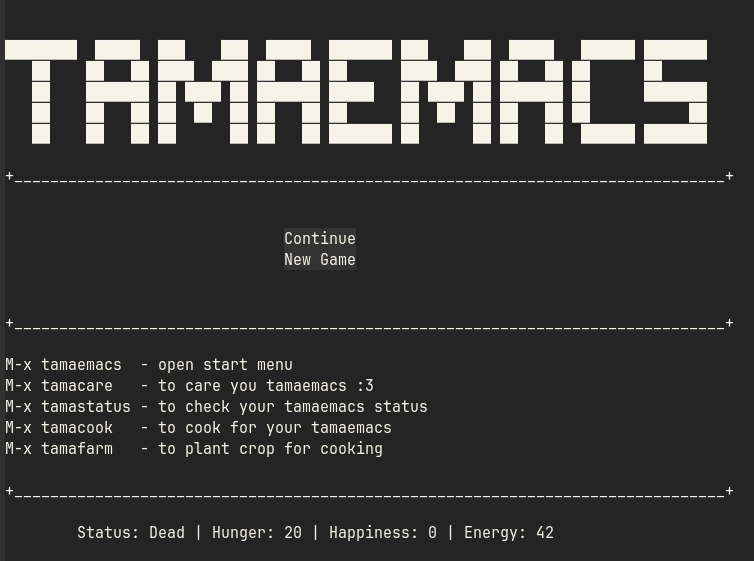
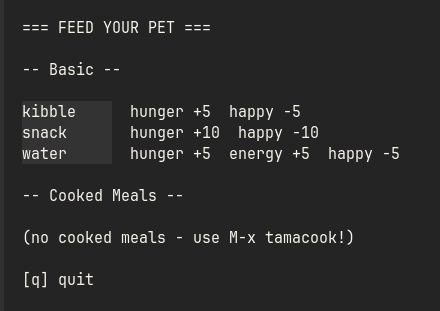
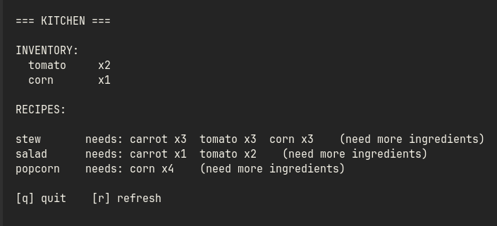
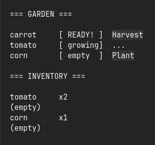

#+TITLE: tamaemacs
#+AUTHOR: tada leledonde

-----

-----

* How to install
*Via source*
  1. git clone https://github.com/tiatatida/tamaemacs-on-emacs.git
  2. package-install-file RET tamaemacs.el
*Via Melpa (not available yet ToT)*
  1. package-install RET tamaemacs RET

-----
     
* How to play
*M-x tamaemacs*
  - start game menu
*M-x tamacare*
  - use this to feed, hug, clean, sleep your tamaemacs
     
  -  *feed* increase your tamaemacs hunger.
  -  *hug* increase your tamaemacs happieness but decrease energy.
  -  *clean* increase your tamaemacs happieness but decrease energy.
  -  *sleep* increase your tamaemacs energy.
*M-x tamastatus*
  - use this to check your tamaeemacs status.
*M-x tamacook
  
  - use this to cook food for your tamaemacs.
*M-x tamafarm
  
  - plant and harvest crop for ingredients.

-----
  
