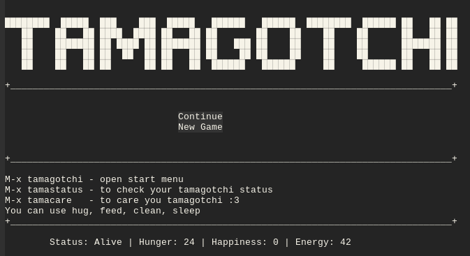

#+TITLE: tamagotchi on emacs
#+AUTHOR: tada leledonde

-----

-----

*How to install*

* Via source
  1. git clone https://github.com/tiatatida/tamagotchi-on-emacs.git
  2. package-install-file RET tamagotchi.el
* Via Melpa (not available yet ToT)
  1. package-install RET tamagotchi RET

-----
     
*How to play*

* M-x tamagotchi
  - start game menu
* M-x tamacare
  - use this to feed, hug, clean, sleep your tamagotchi
    *feed* increase your tamagotchi hunger
    *hug* increase your tamagotchi happieness but decrease energy
    *clean* increase your tamagotchi happieness but decrease energy
    *sleep* increase your tamagotchi energy
* M-x tamastatus
  - use this to check your tamagotchi status

-----
  
